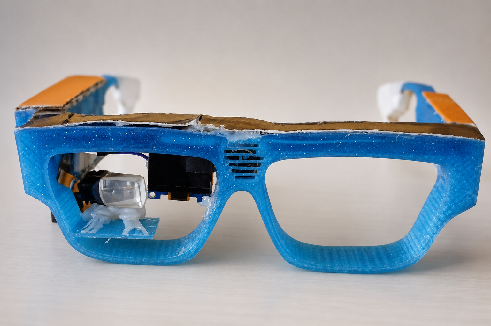
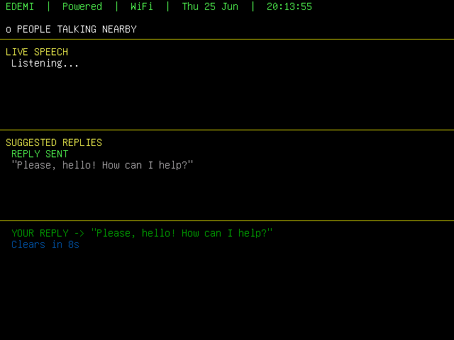
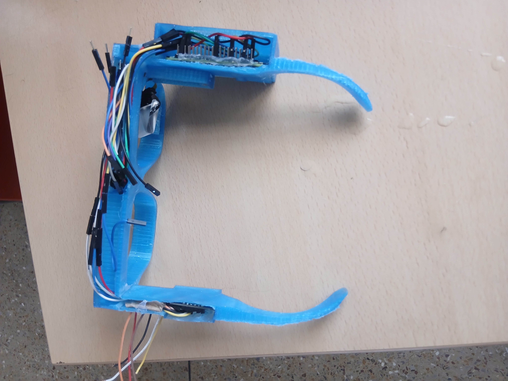

# EDEMI — Smart Glasses for Real-Time Communication Between Deaf and Hearing Individuals

> A wearable assistive technology prototype that enables two-way communication between deaf and hearing individuals through real-time speech captioning, capacitive touch response selection, and ambient sound detection.

---

## The Device


*Figure 1: Final assembled prototype of the smart glasses system*


*Figure 2: SolidWorks CAD design of the glasses frame and component housing*


*Figure 3: The smart glasses worn by a user during a communication session*

---

## Overview

Hearing loss affects approximately 40 million people across Africa, and this figure is projected to rise to 54 million by 2030 (WHO, 2024). While sign language provides a rich communication mode within the deaf community, it is not widely understood by the general population. This creates a significant communication barrier that affects the daily social life of hearing-impaired individuals.

EDEMI addresses this barrier by providing a wearable device that:

- Displays real-time speech captions on a transparent AR screen worn by the deaf user
- Enables the deaf user to send replies to the hearing person via a capacitive touch interface
- Alerts the deaf user to critical environmental sounds through visual notifications

This project was developed as a capstone engineering project, 2026.

---

## How It Works


*Figure 4: AR display showing live speech transcription and reply suggestions*

When a hearing person speaks, the INMP441 microphone captures the audio and forwards it to the Vosk offline speech recognition engine running on the Raspberry Pi Zero 2W. The transcribed text appears live on the AR display so the deaf user can follow the conversation in real time.

The response engine analyses the transcribed text and detects the speaker's intent. For common phrases such as greetings, farewells, and expressions of gratitude, an automatic reply is generated and displayed immediately on the OLED screen for the hearing person to read. For more complex statements, three contextually relevant reply options are presented on the AR display, from which the deaf user selects using the touch pads on the glasses temple.


*Figure 5: OLED display showing the selected reply visible to the hearing conversation partner*

Throughout the conversation, the ambient sound detection module monitors the environment and generates visual alerts for significant sounds such as vehicle noise, nearby conversations, and sudden loud sounds.

---

## Web Configuration


*Figure 6: Web configuration interface accessible via the device hotspot*

The system includes a web-based configuration interface accessible from any browser connected to the device hotspot at `http://192.168.4.1:5000`. Users can configure personal profile settings including name, city, religion, and age group, as well as system preferences such as display settings, alert sensitivity, and emergency messages.

---

## Hardware

| Component | Specification | Role |
|-----------|--------------|------|
| Raspberry Pi Zero 2W | Quad-core 1GHz, 512MB RAM | Central processing unit |
| INMP441 Microphone | MEMS, I2S, -26 dBFS sensitivity | Speech capture |
| Sony ECX336CN | 640×480 HDMI microdisplay | AR display for deaf user |
| SSD1306 OLED | 128×64 pixels, I2C 0x3C | Reply display for hearing partner |
| MPR121 | 12-channel capacitive touch, I2C 0x5A | User input interface |
| Official Pi Charger | 5V / 3A USB-C | System power supply |

---

## Wiring


*Figure 7: Hardware wiring and pin connection diagram*

| Component | Connection | GPIO / Address |
|-----------|-----------|----------------|
| INMP441 SCK | I2S Clock | GPIO 18 |
| INMP441 WS | I2S Word Select | GPIO 19 |
| INMP441 SD | I2S Data | GPIO 20 |
| SSD1306 OLED | I2C Bus 1 | Address 0x3C |
| MPR121 Touch | I2C Bus 1 | Address 0x5A |
| Sony ECX336CN | HDMI | HDMI port |

---

## Software Stack

| Tool | Version | Purpose |
|------|---------|---------|
| Python | 3.11 | Primary programming language |
| Vosk | 0.3.45 | Offline speech recognition engine |
| vosk-model-small-en-us-0.15 | 0.15 | Compact English language model |
| Flask | 3.x | Web configuration server |
| luma.oled | 3.x | SSD1306 OLED display driver |
| smbus2 | 0.4.x | I2C communication |
| alsaaudio | 0.9.x | ALSA audio capture |
| Pillow | 10.x | Image rendering |
| Raspberry Pi OS Trixie | Debian 13, 64-bit | Operating system |

---

## Key Features

### 20 Intent Clusters
The response engine detects 20 categories of spoken intent and generates appropriate replies automatically or as suggestions. These include greetings, farewells, identity queries, location questions, payment phrases, compliments, and more.

### Ghana-Aware Replies
The system detects and responds naturally to Ghanaian everyday phrases including:
- "Akwaaba" → "Please, akwaaba! You are welcome!"
- "How now" → "Please, I am fine! And you?"
- "Chale / Charley" → "Please, yes! How can I help?"
- "Ei" → "Oh wow, is that so?"
- "Medaase" → "God bless you too, please! You are most welcome."

### Religion-Aware Responses
Replies are personalised based on the user's religion setting:
- Christian: "I am fine by God's grace, please!"
- Muslim: "I am fine, Alhamdulillah, please!"

### Deaf Explanation
When someone asks "Are you deaf?" or "Why aren't you talking?", the system automatically responds:
> "Please, my name is [Name]. I am deaf and I use smart glasses to communicate. Please speak normally and I will reply here."

### Touch Pad Layout

| Pad | Function |
|-----|---------|
| Pad 1 | Scroll Up |
| Pad 2 | Scroll Down |
| Pad 3 | Select / Confirm reply |
| Pad 4 | Clear OLED display |
| Pad 5 | Clear speech display |
| Pad 6 (hold 3s) | Open system menu |

### System Menu
Accessible by holding Pad 6 for three seconds. Options include Resume, Clear Conversation, and Shutdown.

### Auto-Boot
The system starts automatically when powered on. No keyboard or login required. The device is fully operational within approximately two minutes of being powered on.

---

## Project Structure

```
EDEMI/
├── main.py                  # Entry point — run this file
├── ar_display_pi.py         # AR curses display (deaf user sees this)
├── oled_display_pi.py       # OLED display driver (hearing person reads this)
├── touch_input.py           # MPR121 capacitive touch controller
├── speech_engine.py         # Vosk speech recognition pipeline
├── response_engine.py       # Intent detection and reply generation
├── environment_monitor.py   # Ambient sound detection
├── conversation_memory.py   # Conversation history tracking
├── web_config.py            # Flask web configuration server
├── settings_manager.py      # Settings persistence (settings.json)
├── system_monitor.py        # WiFi and uptime monitoring
├── config.py                # Central configuration constants
├── settings.json            # User settings file
└── templates/
    └── index.html           # Web configuration interface
```

---

## Running the System

```bash
cd /home/smart-pi/edemi
python3 main.py 2>/dev/null
```

The system must be run from the Pi physical console (not SSH) as the curses AR display requires a real terminal.

---

## Limitations

- Speech recognition accuracy may decline with heavy accents or specialised vocabulary not covered by the small language model
- Optimised for quiet to moderately noisy indoor environments
- English language with Ghanaian contextual phrases; other languages not yet supported
- Prototype form factor; not yet miniaturised for extended daily wearable use

---

## Future Work

- Integration of a large language model (LLM) for open-ended conversation handling
- FFT-based frequency analysis for more precise ambient sound classification
- Multilingual support using alternative Vosk language models
- Custom PCB design for miniaturisation and improved wearability
- Extended user trials with hearing-impaired participants
- Read-only filesystem implementation for SD card longevity

---

## Capstone Project

**Title:** Smart Glasses for Real-Time Communication Between Deaf and Hearing Individuals  
**Department:** Electrical and Electronic Engineering and Computer Engineering 
**Year:** 2026  
**Team:** Ibrahim Moro - Taiwo Abolade Opafunso - Judikael Bidossesi Lokossi
**Institution:** Accra Institute of Technology  

---

## License

Developed for academic purposes. All rights reserved © 2026.
